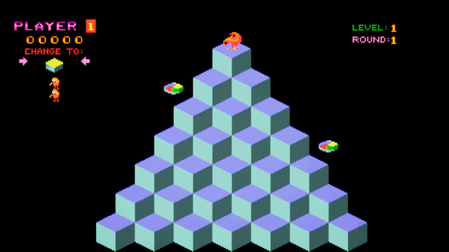
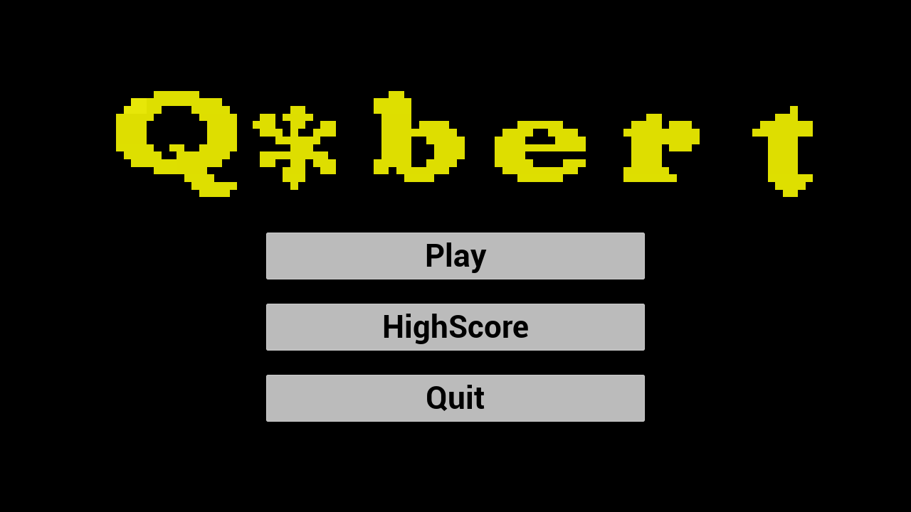
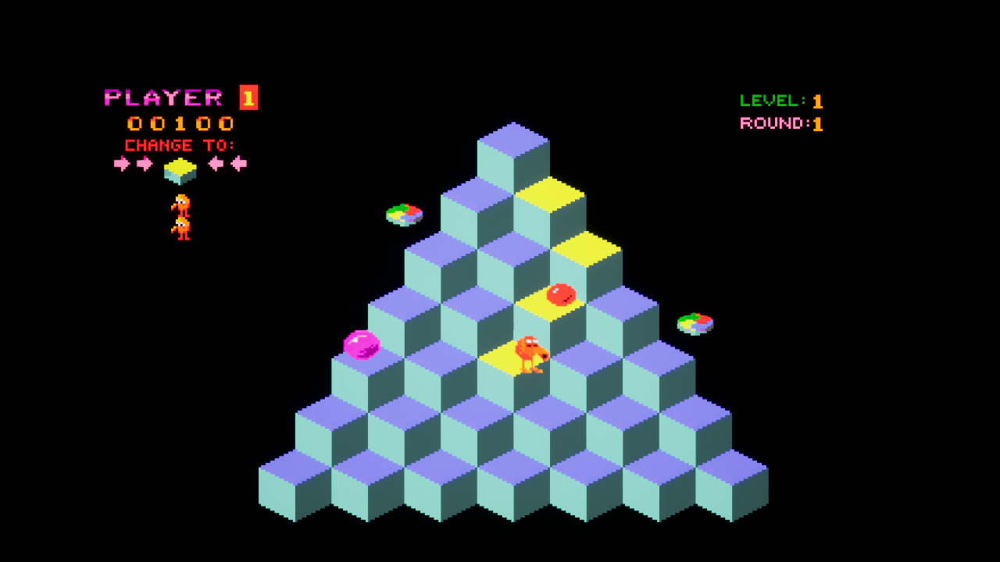
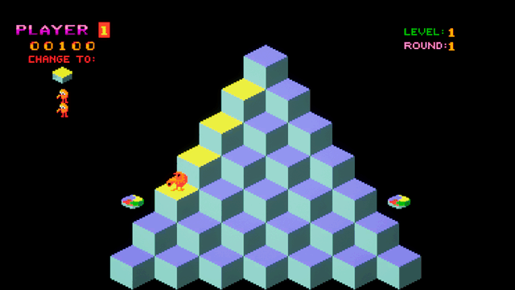
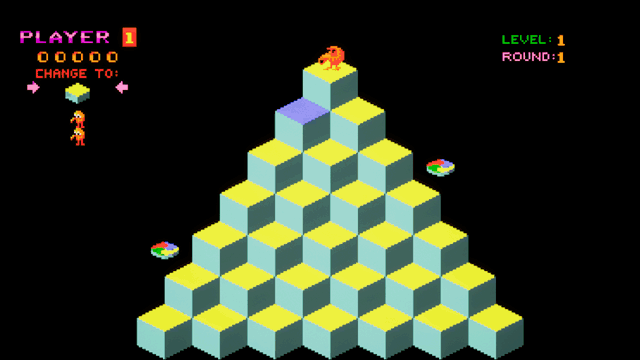
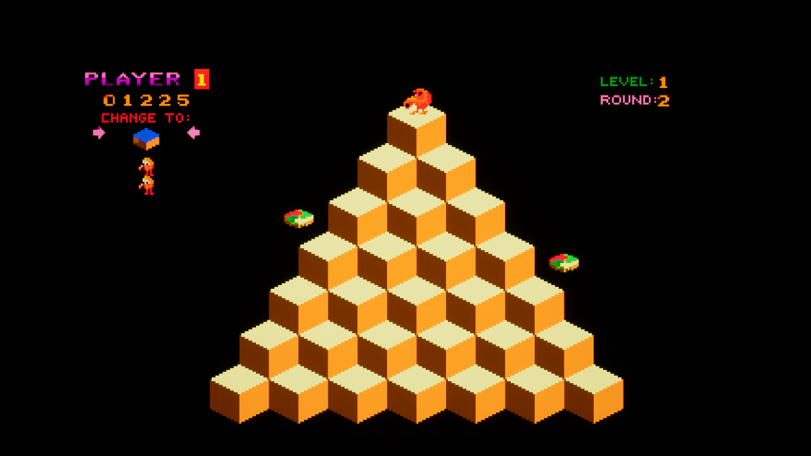
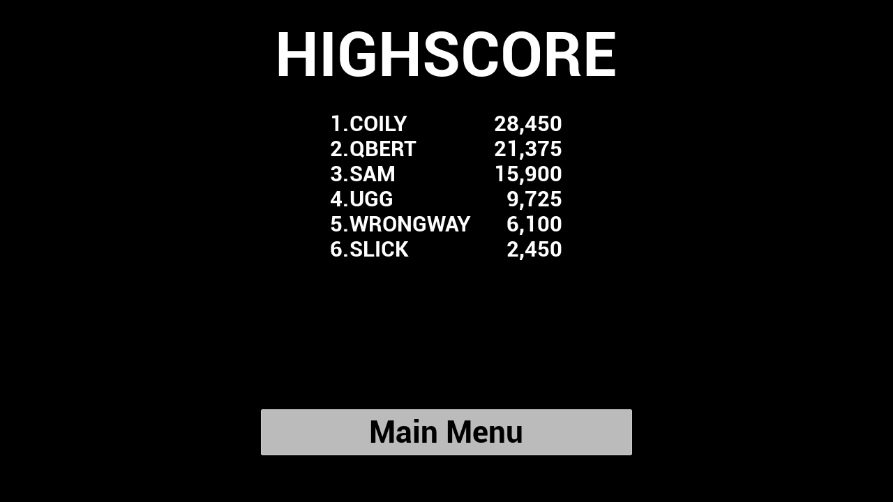

<div align="center">

# Q\*bert — Unreal Engine 5 Remake

**A faithful remake of the 1982 arcade classic, built in Unreal Engine 5.8 with C++ and Paper2D.**




</div>

---

## Contents

- [About](#about)
- [Features](#features)
- [Screenshots](#screenshots)
- [Quick start](#quick-start)
- [Controls](#controls)
- [Architecture](#architecture)
- [Technical highlights](#technical-highlights)
- [Project structure](#project-structure)
- [Debug commands](#debug-commands)
- [Credits](#credits)

## About

Hop around an isometric pyramid, landing on every cube to change it to the target colour while
dodging bouncing balls and Coily the snake. Clear four rounds, each with a new colour scheme, to win.

The project is built around a clean split between **C++ gameplay code** and **data-only Blueprints**.
Every rule, movement curve, AI decision and UI behaviour lives in C++. Blueprints only assign art,
audio and class references, and Widget Blueprints hold UMG layouts for C++ widget classes.

## Features

- **Full arcade loop:** four rounds with unique colour themes, score, lives, round-clear bonuses and a game-over / victory flow.
- **Enemies with distinct behaviour:**
  - **Red balls** bounce down the pyramid and cost a life on contact.
  - **Green balls** are worth points and freeze every other enemy for five seconds.
  - **Coily** starts as an egg, hatches at the bottom and chases Q\*bert cube by cube.
- **Escape discs:** ride a disc back to the apex. If Coily is right behind you, he follows you off the edge for a 500-point bonus.
- **Procedural pyramid:** the 28-cube board is generated from grid maths instead of hand-placed actors.
- **Arcade-style HUD:** a sprite-based scoreboard with zero-padded score, spare lives, a "change to" target and blinking arrows.
- **Front end:** main menu, pause menu, name entry and a persistent top-10 high-score table.
- **Enhanced Input** with keyboard and numpad layouts.

## Screenshots

<table>
  <tr>
    <td></td>
    <td></td>
  </tr>
  <tr>
    <td align="center"><b>Main menu</b></td>
    <td align="center"><b>Changing cubes while enemies drop in</b></td>
  </tr>
  <tr>
    <td></td>
    <td></td>
  </tr>
  <tr>
    <td align="center"><b>Riding an escape disc</b></td>
    <td align="center"><b>Clearing a round</b></td>
  </tr>
  <tr>
    <td></td>
    <td></td>
  </tr>
  <tr>
    <td align="center"><b>Round 2 theme</b></td>
    <td align="center"><b>Saved high-score table</b></td>
  </tr>
</table>

## Quick start

### Requirements

| Tool | Version |
| --- | --- |
| Unreal Engine | 5.8 |
| Visual Studio | 2022 with the **Game development with C++** workload (the editor offers to install missing components via `.vsconfig`) |
| OS | Windows 10 / 11 |

### Run in the editor

```bash
git clone <this-repo-url> QBert
```

1. Right-click `QBert.uproject` → **Generate Visual Studio project files**.
2. Open `QBert.sln`, select **Development Editor / Win64** and build the `QBert` project.
3. Open `QBert.uproject`. The editor starts on the game map; switch to `Content/Maps/MainMenu` and press **Play** to start from the front end.

> Prefer not to open Visual Studio? Double-clicking `QBert.uproject` will offer to build the missing module for you.

### Package a standalone build

In the editor choose **Platforms → Windows → Package Project**, or from the command line:

```bash
"<UE_5.8>/Engine/Build/BatchFiles/RunUAT.bat" BuildCookRun -project="<path>/QBert.uproject" -platform=Win64 -clientconfig=Shipping -build -cook -stage -pak -archive -archivedirectory="<output>"
```

## Controls

| Action | Keyboard | Numpad |
| --- | --- | --- |
| Hop up-left | `Q` | `7` |
| Hop up-right | `E` | `9` |
| Hop down-left | `Z` | `1` |
| Hop down-right | `C` | `3` |
| Pause | `Esc` | |

Gamepad **Start** also pauses the game.

## Architecture

| Area | Class | Responsibility |
| --- | --- | --- |
| Rules | `AQBertGameMode` | Score, lives and rounds; round-clear, caught, fell-off and game-over sequences |
| Board | `AQBertPyramid` | Generates the cube grid, tracks cube colours, flashes the pyramid, spawns escape discs |
| Movement | `AQBertCharacter`, `UQBertMoverComponent` | Shared grid hopping and falling along frame-rate-independent Bezier arcs |
| Player | `AQBertPlayerCharacter` | Enhanced Input hops, disc rides, enemy contact |
| Enemies | `AQBertEnemy` → `AQBertBall`, `AQBertGreenBall`, `AQBertCoily` | Think loop, freezing; Coily's egg → hatch → chase state machine |
| Spawning | `AQBertEnemySpawner` | Timed, weighted enemy drops |
| HUD | `AQBertScoreboard` | In-world sprite HUD driven by game mode delegates (no polling) |
| Front end | `AQBertPlayerController`, `AQBertMenuGameMode`, `UQBert*Widget` | Menu flow, pause, name entry; widgets bind to UMG layouts with `BindWidget` |
| Persistence | `UQBertHighScoreSubsystem` | Ranked top-10 table saved with `USaveGame` |

### C++ vs Blueprint split

| Lives in C++ | Lives in Blueprint / UMG |
| --- | --- |
| Rules, timing and state | Sprite, flipbook and sound assignments (`BP_QBert`, `BP_Coily`, `BP_Pyramid`, …) |
| Movement and AI | Class wiring (`BP_QBertGameMode` → pawn, controller, spawner) |
| UI behaviour (`UQBertMainMenuWidget`, …) | UI layout (`WBP_MainMenu`, `WBP_HighScores`, …) |

Designers can retheme the game, swap sounds or tweak timings in the Details panel without touching code.

## Technical highlights

**Skewed grid maths.** The pyramid uses a skewed grid: row `Y` (1 = bottom, 7 = apex) contains cubes
`X = 1 … 8 − Y`. Each of the four hops is a fixed integer delta, so cube lookups, falling off the edge and
pathfinding are all constant-time integer operations. Cells off the pyramid are open air, unless a disc is parked there.

```cpp
inline FIntPoint GetDelta(EQBertDirection Direction)
{
    switch (Direction)
    {
    case EQBertDirection::UpLeft:   return FIntPoint(-1, 1);
    case EQBertDirection::UpRight:  return FIntPoint(0, 1);
    case EQBertDirection::DownLeft: return FIntPoint(0, -1);
    default:                        return FIntPoint(1, -1);
    }
}
```

**Frame-rate-independent movement.** Every hop, fall and disc ride goes through `UQBertMoverComponent`.
It evaluates a quadratic Bezier from a fixed start point over a fixed duration, so arcs look the same at 30, 60 or 144 FPS.

**Coily's chase AI.** Once hatched, Coily picks whichever neighbouring cube is closest to the cube
Q\*bert last stood on. If Q\*bert escapes on a disc while Coily stands on the cube he jumped from, Coily
follows him into open air. That reproduces the arcade's lure trick.

**Event-driven HUD.** The scoreboard subscribes to `OnScoreChanged`, `OnLivesChanged` and `OnRoundChanged`
multicast delegates on the game mode rather than polling every tick.

**Timer-driven sequences.** Death, respawn and round-clear sequences use weak-lambda timers bound to their
owner, so they cancel cleanly if the actor is destroyed or the game ends mid-sequence.

## Project structure

```text
QBert/
├── Config/                     Engine, game and input settings
├── Content/
│   ├── Animation/              Paper2D flipbooks
│   ├── Blueprints/             Data-only Blueprints (Characters, Game, World)
│   ├── Input/                  Enhanced Input actions + mapping context
│   ├── Maps/                   MainMenu, QBert
│   ├── Sounds/
│   ├── Sprites/
│   └── UI/                     Widget Blueprint layouts
├── Docs/Media/                 README screenshots and GIFs
└── Source/QBert/
    ├── Public/                 Headers (Characters, Core, UI, World)
    └── Private/                Implementation
```

## Debug commands

Available in non-shipping builds. Open the console with `~`:

| Command | Effect |
| --- | --- |
| `QBertAddScore <points>` | Adds points |
| `QBertSpawn Red\|Green\|Coily` | Drops an enemy onto the pyramid |
| `QBertFinishRound` | Completes the current round |
| `QBertToggleSpawner` | Pauses or resumes enemy spawning |

## Credits

*Q\*bert* was created by Warren Davis and Jeff Lee for Gottlieb in 1982. The name, characters, sprites
and sounds are the property of their respective rights holders. This is a non-commercial fan remake made
for learning and as a portfolio piece; it is not affiliated with or endorsed by the rights holders.
